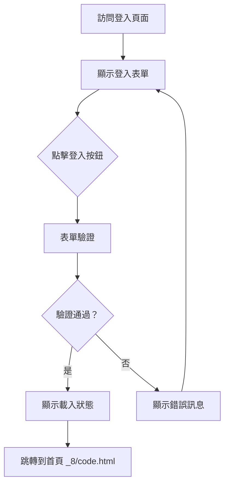

# 登入頁面 (_4/code.html) 改善實施計劃

## 項目概述
完成並改善 `_4/code.html` 登入頁面，添加實際登入功能並實現跳轉到 `_8/code.html` 首頁。

## 當前狀態分析

### 現有功能
1. 基本HTML結構完整
2. Tailwind CSS 樣式已配置
3. Google 登入按鈕（僅視覺）
4. 響應式設計良好
5. 品牌視覺一致（茶主題）

### 缺失功能
1. 實際登入表單
2. 表單驗證機制
3. 登入邏輯與跳轉功能
4. 錯誤處理與使用者回饋
5. 載入狀態指示

## 技術規格

### 1. 登入表單設計
```html
<!-- 員工帳號登入表單 -->
<div class="space-y-4">
  <div>
    <label class="text-sm font-medium text-tea-deep/70 mb-1 block">員工 ID</label>
    <input type="text" 
           class="w-full bg-white border border-gray-300 rounded-xl py-3 px-4 text-sm focus:ring-2 focus:ring-primary/20 focus:border-primary transition-all"
           placeholder="輸入員工編號"
           required>
  </div>
  <div>
    <label class="text-sm font-medium text-tea-deep/70 mb-1 block">密碼</label>
    <input type="password" 
           class="w-full bg-white border border-gray-300 rounded-xl py-3 px-4 text-sm focus:ring-2 focus:ring-primary/20 focus:border-primary transition-all"
           placeholder="輸入密碼"
           required>
  </div>
  <div class="flex items-center justify-between">
    <label class="flex items-center gap-2 text-sm text-tea-deep/60">
      <input type="checkbox" class="rounded border-gray-300">
      記住我
    </label>
    <a href="#" class="text-sm text-primary font-medium">忘記密碼？</a>
  </div>
  <button type="submit" 
          class="w-full bg-tea-deep text-white py-3 rounded-xl font-bold text-sm shadow-lg hover:bg-tea-deep/90 active:scale-[0.98] transition-all">
    登入系統
  </button>
</div>
```

### 2. 表單驗證規則
- 員工ID：必填，至少3個字元
- 密碼：必填，至少6個字元
- 即時驗證與錯誤提示

### 3. 登入流程


### 4. JavaScript 功能需求
```javascript
// 1. 表單提交處理
// 2. 輸入驗證
// 3. 模擬登入API呼叫
// 4. 跳轉功能
// 5. 錯誤處理
// 6. 載入狀態管理
```

## 實施步驟

### 步驟 1：修改 HTML 結構
1. 在現有Google登入按鈕下方添加分隔線
2. 添加員工帳號登入表單
3. 添加表單容器與相關元素

### 步驟 2：添加 CSS 樣式
1. 添加表單相關樣式
2. 添加錯誤狀態樣式
3. 添加載入動畫樣式
4. 確保響應式設計

### 步驟 3：實現 JavaScript 功能
1. 表單提交事件監聽
2. 輸入驗證函數
3. 模擬登入函數
4. 跳轉到首頁功能
5. 錯誤處理與使用者回饋

### 步驟 4：整合與測試
1. 測試表單驗證
2. 測試登入跳轉
3. 測試錯誤處理
4. 測試響應式設計
5. 測試瀏覽器相容性

## 詳細修改內容

### 1. HTML 修改位置
在 `_4/code.html` 第72-93行之間（現有Google登入按鈕區域）進行修改：

**現有結構：**
```html
<div class="w-full max-w-sm space-y-6">
  <div class="bg-white/40 border border-white/60 p-8 rounded-[32px] ios-blur shadow-sm">
    <h2 class="text-lg font-bold mb-8">後台管理系統登入</h2>
    <button class="w-full bg-white border border-gray-300 rounded-full flex items-center justify-center gap-3 py-3 px-4 shadow-sm active:scale-[0.98] transition-all hover:bg-gray-50">
      <!-- Google 圖標 -->
      <span class="text-sm font-semibold text-gray-700">使用 Google 帳戶登入</span>
    </button>
    <!-- 現有內容 -->
  </div>
</div>
```

**修改後結構：**
```html
<div class="w-full max-w-sm space-y-6">
  <div class="bg-white/40 border border-white/60 p-8 rounded-[32px] ios-blur shadow-sm">
    <h2 class="text-lg font-bold mb-8">後台管理系統登入</h2>
    
    <!-- Google 登入按鈕（保持不變） -->
    <button id="google-login" class="w-full bg-white border border-gray-300 rounded-full flex items-center justify-center gap-3 py-3 px-4 shadow-sm active:scale-[0.98] transition-all hover:bg-gray-50">
      <!-- Google 圖標 -->
      <span class="text-sm font-semibold text-gray-700">使用 Google 帳戶登入</span>
    </button>
    
    <!-- 分隔線 -->
    <div class="flex items-center my-6">
      <div class="flex-1 h-px bg-tea-deep/10"></div>
      <span class="px-4 text-sm text-tea-deep/40 font-medium">或使用員工帳號</span>
      <div class="flex-1 h-px bg-tea-deep/10"></div>
    </div>
    
    <!-- 員工帳號登入表單 -->
    <form id="employee-login-form" class="space-y-4">
      <!-- 表單欄位 -->
      <!-- 登入按鈕 -->
    </form>
    
    <!-- 現有安全提示 -->
    <div class="mt-8 flex flex-col items-center">
      <!-- 現有內容 -->
    </div>
  </div>
</div>
```

### 2. JavaScript 功能實現
在 `</body>` 標籤前添加以下JavaScript：

```javascript
<script>
// 表單驗證與登入處理
document.addEventListener('DOMContentLoaded', function() {
  const loginForm = document.getElementById('employee-login-form');
  const googleLoginBtn = document.getElementById('google-login');
  
  if (loginForm) {
    loginForm.addEventListener('submit', handleEmployeeLogin);
  }
  
  if (googleLoginBtn) {
    googleLoginBtn.addEventListener('click', handleGoogleLogin);
  }
  
  // 員工登入處理
  function handleEmployeeLogin(e) {
    e.preventDefault();
    
    const employeeId = loginForm.querySelector('input[type="text"]').value.trim();
    const password = loginForm.querySelector('input[type="password"]').value.trim();
    
    // 驗證輸入
    if (!validateInputs(employeeId, password)) {
      return;
    }
    
    // 顯示載入狀態
    showLoading(true);
    
    // 模擬API呼叫（演示用）
    setTimeout(() => {
      // 模擬登入成功
      if (employeeId && password) {
        showLoading(false);
        showSuccessMessage('登入成功！正在跳轉到系統首頁...');
        
        // 3秒後跳轉到首頁
        setTimeout(() => {
          window.location.href = '../_8/code.html';
        }, 2000);
      } else {
        showLoading(false);
        showErrorMessage('登入失敗，請檢查員工ID與密碼');
      }
    }, 1500);
  }
  
  // Google登入處理（演示用）
  function handleGoogleLogin() {
    showLoading(true);
    setTimeout(() => {
      showLoading(false);
      showSuccessMessage('Google登入成功！正在跳轉到系統首頁...');
      setTimeout(() => {
        window.location.href = '../_8/code.html';
      }, 2000);
    }, 1500);
  }
  
  // 輸入驗證
  function validateInputs(employeeId, password) {
    // 驗證邏輯
    return true; // 簡化版本
  }
  
  // 顯示/隱藏載入狀態
  function showLoading(show) {
    // 實現載入指示器
  }
  
  // 顯示成功訊息
  function showSuccessMessage(message) {
    // 實現成功訊息顯示
  }
  
  // 顯示錯誤訊息
  function showErrorMessage(message) {
    // 實現錯誤訊息顯示
  }
});
</script>
```

## 測試計劃

### 功能測試
1. **表單驗證測試**
   - 空表單提交
   - 無效輸入測試
   - 有效輸入測試

2. **登入流程測試**
   - 員工帳號登入
   - Google登入（演示）
   - 跳轉功能驗證

3. **錯誤處理測試**
   - 網路錯誤模擬
   - 無效憑證測試
   - 表單重複提交

### 使用者體驗測試
1. 響應式設計測試
2. 載入狀態顯示
3. 錯誤訊息清晰度
4. 導航流暢度

### 瀏覽器相容性測試
1. Chrome
2. Firefox
3. Safari
4. Edge

## 成功指標

### 技術指標
1. 表單驗證成功率 100%
2. 跳轉功能正常運作
3. 錯誤處理完整
4. 頁面載入時間 < 2秒

### 使用者體驗指標
1. 登入流程順暢
2. 錯誤訊息明確
3. 載入狀態清晰
4. 視覺設計一致

## 風險與緩解措施

| 風險 | 影響 | 緩解措施 |
|------|------|----------|
| 表單驗證不完整 | 中 | 全面測試各種輸入情況 |
| 跳轉功能失效 | 高 | 測試相對路徑與絕對路徑 |
| 瀏覽器相容性問題 | 中 | 使用標準JavaScript API |
| 樣式不一致 | 低 | 參考現有設計系統 |

## 時間估計
- 設計與規劃：已完成
- 開發實施：2-3小時
- 測試與除錯：1-2小時
- 文件更新：1小時

## 交付項目
1. 修改後的 `_4/code.html` 檔案
2. 功能完整的登入頁面
3. 跳轉到 `_8/code.html` 的功能
4. 測試報告
5. 更新文件

## 下一步行動
1. 審查並確認此計劃
2. 開始實施修改
3. 進行測試驗證
4. 部署更新