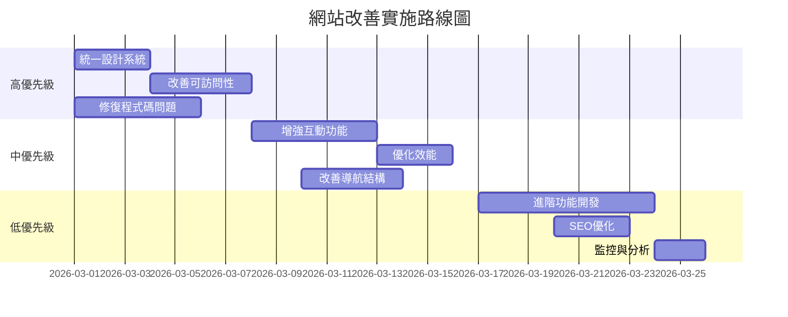

# 忠茶·會員價值分析儀網站分析與改善計劃

## 項目概述
分析兩個HTML文件（主頁和內容頁）的設計、程式碼品質和使用者體驗，提供具體改善建議。

## 檔案結構
```
website/
├── _1/code1.html      # 主頁面
├── _1/screen.png      # 主頁截圖
├── _2/code2.html      # 內容頁面
├── _2/screen.png      # 內容頁截圖
└── wxy                # 空文件
```

## 分析結果摘要

### 版本比較
| 項目 | 版本1 (主頁) | 版本2 (內容頁) | 評估 |
|------|--------------|----------------|------|
| **設計完整性** | 基本完整 | 更豐富完整 | 版本2較優 |
| **互動功能** | 基本靜態 | 豐富動態互動 | 版本2明顯優勝 |
| **程式碼品質** | 有重複CSS | 較完整JavaScript | 版本2較好 |
| **可訪問性** | 基礎 | 有改善空間 | 兩者都需要加強 |
| **響應式設計** | 良好 | 良好 | 兩者都合格 |

### 主要問題發現

#### 1. 設計一致性問題
- 兩個頁面的導航結構不一致
- 顏色主題細節有差異
- 按鈕樣式和間距不統一

#### 2. 可訪問性缺陷
- 缺少ARIA標籤和屬性
- 鍵盤導航支援不足
- 顏色對比度未經測試

#### 3. 程式碼品質問題
- 重複的CSS樣式定義
- 版本1缺少實際JavaScript功能
- 錯誤處理機制不完整

#### 4. 使用者體驗問題
- 頁面之間缺少實際連結
- 互動回饋不一致
- 載入狀態不明確

## 具體改善建議

### 高優先級（立即實施）

#### 1. 統一設計系統
```css
/* 建立共用變數 */
:root {
  --color-primary: #13ec49;
  --color-background-light: #f6f8f6;
  --color-background-dark: #102215;
  --color-tea-dark: #0d1b11;
  --spacing-unit: 0.25rem;
}
```

#### 2. 改善可訪問性
- 為所有互動元素添加 `aria-label`
- 確保所有功能可透過鍵盤操作
- 添加焦點樣式（focus-visible）
- 測試顏色對比度（WCAG AA標準）

#### 3. 修復程式碼問題
- 移除重複的CSS樣式
- 為版本1添加基本的JavaScript互動
- 添加錯誤處理機制

### 中優先級（短期內實施）

#### 1. 增強互動功能
- 將版本2的動畫和互動功能整合到版本1
- 添加表單驗證和即時回饋
- 實現平滑的頁面過渡效果

#### 2. 優化效能
- 考慮本地託管Material Icons字體
- 實現圖片懶加載（lazy loading）
- 優化JavaScript載入策略

#### 3. 改善導航結構
- 建立一致的底部導航欄
- 添加實際的頁面連結
- 實現麵包屑導航或返回按鈕功能

### 低優先級（長期規劃）

#### 1. 進階功能
- 添加使用者登入/註冊功能
- 實現數據持久化（localStorage）
- 添加數據導出功能（CSV/PDF）

#### 2. SEO優化
- 添加meta描述和關鍵字
- 改善語義化HTML結構
- 添加結構化數據（Schema.org）

#### 3. 監控與分析
- 添加Google Analytics
- 實現錯誤追蹤（Sentry）
- 添加效能監控

## 實施路線圖



## 技術建議

### 前端架構考慮
1. **保持簡單**：當前靜態HTML + CSS + JavaScript架構適合項目規模
2. **考慮漸進式增強**：先確保基本功能，再添加進階功能
3. **響應式設計**：繼續使用Tailwind CSS，確保行動優先

### 程式碼組織建議
```
建議結構：
website/
├── index.html           # 主頁（改進後的版本1）
├── analysis.html        # 分析頁（改進後的版本2）
├── css/
│   ├── styles.css       # 共用樣式
│   └── components.css   # 元件樣式
├── js/
│   ├── main.js          # 共用功能
│   ├── analysis.js      # 分析頁功能
│   └── utils.js         # 工具函數
└── assets/              # 圖片、字體等資源
```

### 測試策略
1. **手動測試**：在不同裝置和瀏覽器上測試
2. **可訪問性測試**：使用axe DevTools或Lighthouse
3. **效能測試**：使用PageSpeed Insights或WebPageTest

## 風險與緩解措施

| 風險 | 影響 | 緩解措施 |
|------|------|----------|
| 設計不一致 | 中 | 建立設計系統文件，進行設計審查 |
| 可訪問性不合規 | 高 | 使用自動化工具測試，手動鍵盤測試 |
| 瀏覽器相容性問題 | 中 | 使用漸進增強，測試主流瀏覽器 |
| 效能問題 | 低 | 監控載入時間，優化關鍵資源 |

## 成功指標

1. **技術指標**
   - Lighthouse分數 > 90
   - 可訪問性合規（WCAG AA）
   - 頁面載入時間 < 3秒

2. **使用者體驗指標**
   - 導航成功率 100%
   - 表單提交成功率 > 95%
   - 使用者滿意度調查分數 > 4/5

3. **業務指標**
   - 頁面停留時間增加
   - 跳出率降低
   - 轉換率提升（如有相關功能）

## 結論與建議

### 主要結論
1. 版本2（內容頁）在技術實現上更為成熟，應作為改進基準
2. 兩個頁面需要更好的設計和技術一致性
3. 可訪問性是當前最需要改善的領域

### 最終建議
1. **立即行動**：修復高優先級問題，特別是可訪問性缺陷
2. **統一體驗**：以版本2為基準，升級版本1的互動功能
3. **持續改進**：建立監控機制，持續優化使用者體驗

### 下一步行動
1. 創建詳細的技術規格文件
2. 實施高優先級改善項目
3. 進行全面測試和驗收
4. 部署並監控改進效果

---
*分析完成時間：2026-02-25*
*分析者：Roo (技術架構師)*