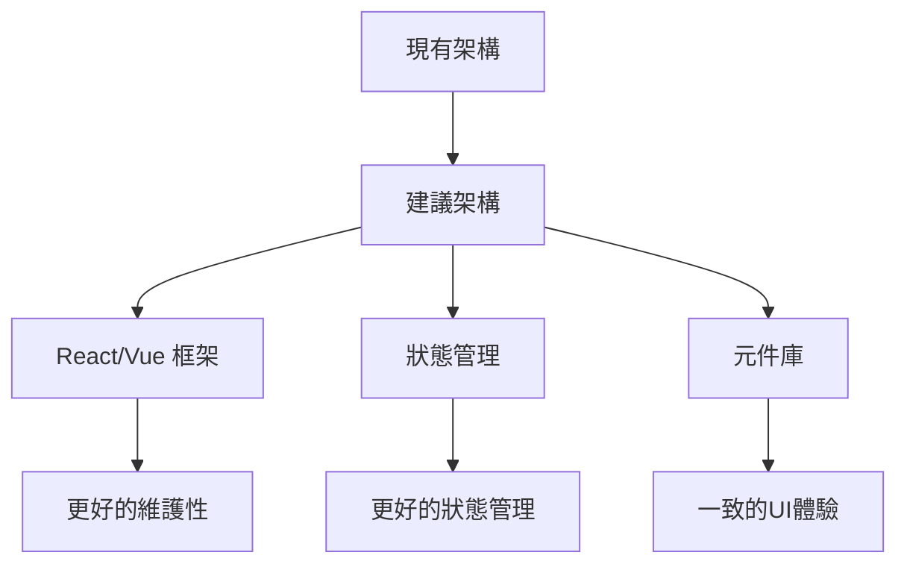

# 網站分析與改善計劃

## 1. 當前網站結構分析

### 現有頁面功能概覽

| 頁面 | 檔案 | 主要功能 | 狀態 |
|------|------|----------|------|
| 總覽頁面 | `_8/code.html` | 數據儀表板、快速入口 | 功能完整 |
| 趨勢報告 | `_2/code.html` | 週期趨勢圖表、會員價值分析儀 | 已整合分析儀功能 |
| 批次數據導入 | `_3/code.html` | 檔案上傳、批量分析 | 按鈕位置已修復 |
| 精準行銷 | `_1/code.html` | 客群分眾、推薦方案 | 顏色已統一 |
| 登入頁面 | `_4/code.html` | 用戶認證、Google登入 | 功能完整 |
| 載入頁面 | `_5/code.html` | 啟動畫面、進度指示 | 功能完整 |
| 分析儀原始版 | `_6/code.html` | 會員價值分析（獨立頁面） | 功能完整 |
| 分析儀進階版 | `_7/code.html` | 會員價值分析（儀表板樣式） | 功能完整 |

### 技術架構分析
- **前端框架**: Tailwind CSS + 自定義樣式
- **圖標庫**: Google Material Symbols
- **互動功能**: JavaScript (原生)
- **響應式設計**: 430px 移動優先設計
- **顏色方案**: 茶色主題 (#5D4037, #E8F0E8, #4CAF50)

## 2. 可增加的功能建議

### 2.1 數據可視化增強
1. **互動式圖表**
   - 點擊圖表數據點顯示詳細資訊
   - 時間範圍選擇器（日/週/月/季）
   - 圖表類型切換（折線圖/柱狀圖/圓餅圖）

2. **即時數據更新**
   - WebSocket 連接即時數據流
   - 自動刷新儀表板
   - 數據變更通知

3. **數據導出功能**
   - 圖表圖片下載 (PNG/SVG)
   - 數據 CSV/Excel 導出
   - 報告 PDF 生成

### 2.2 會員管理功能
1. **會員資料庫**
   - 會員列表與搜尋
   - 會員詳細資料頁面
   - 會員標籤管理系統

2. **互動功能**
   - 會員訊息發送（Email/SMS）
   - 優惠券管理與發放
   - 會員活動記錄

3. **AI 推薦增強**
   - 機器學習模型推薦
   - A/B 測試功能
   - 推薦效果追蹤

### 2.3 系統管理功能
1. **用戶權限管理**
   - 角色基礎權限控制 (RBAC)
   - 團隊成員管理
   - 操作日誌記錄

2. **系統設定**
   - 公司資訊設定
   - 通知偏好設定
   - API 金鑰管理

3. **數據備份與還原**
   - 定期自動備份
   - 手動備份觸發
   - 數據還原功能

## 3. 使用者體驗改善建議

### 3.1 導航與流程優化
1. **麵包屑導航**
   - 顯示當前位置路徑
   - 快速返回上層頁面

2. **全域搜尋**
   - 跨頁面內容搜尋
   - 搜尋結果分類
   - 搜尋歷史記錄

3. **快捷操作**
   - 鍵盤快捷鍵支援
   - 常用操作捷徑
   - 自定義工作區

### 3.2 介面設計改善
1. **暗黑模式**
   - 系統主題切換
   - 自動跟隨系統設定
   - 自定義顏色方案

2. **無障礙功能**
   - 鍵盤導航支援
   - 螢幕閱讀器相容
   - 對比度調整選項

3. **動畫與過渡**
   - 頁面轉場動畫
   - 載入狀態指示
   - 互動回饋動畫

### 3.3 行動裝置優化
1. **手勢操作**
   - 滑動手勢導航
   - 下拉刷新
   - 雙指縮放圖表

2. **離線功能**
   - 本地數據緩存
   - 離線操作記錄
   - 網路狀態偵測

## 4. 技術架構改善建議

### 4.1 前端架構升級

### 4.2 後端整合建議
1. **RESTful API 設計**
   - 標準化 API 端點
   - 版本控制
   - 速率限制

2. **數據庫優化**
   - 索引優化
   - 查詢緩存
   - 分頁處理

3. **安全性增強**
   - JWT 認證
   - CSRF 保護
   - 輸入驗證

### 4.3 部署與監控
1. **CI/CD 流程**
   - 自動化測試
   - 自動化部署
   - 滾動更新

2. **效能監控**
   - 應用程式效能監控
   - 錯誤追蹤
   - 使用者行為分析

## 5. 實施優先級建議

### 高優先級（立即實施）
1. **全域搜尋功能** - 提升使用者效率
2. **數據導出功能** - 滿足業務需求
3. **會員詳細資料頁面** - 完善會員管理

### 中優先級（短期規劃）
1. **暗黑模式** - 提升使用者體驗
2. **互動式圖表** - 增強數據分析
3. **API 整合** - 為擴展做準備

### 低優先級（長期規劃）
1. **AI 推薦增強** - 需要數據積累
2. **離線功能** - 技術複雜度高
3. **團隊協作功能** - 需要權限系統

## 6. 具體實施步驟

### 階段一：基礎功能增強（1-2週）
1. 實現全域搜尋功能
2. 添加圖表數據導出
3. 建立會員詳細資料頁面
4. 優化移動端手勢操作

### 階段二：使用者體驗提升（2-3週）
1. 實現暗黑模式
2. 添加頁面轉場動畫
3. 改善無障礙功能
4. 添加鍵盤快捷鍵

### 階段三：技術架構升級（3-4週）
1. 引入前端框架（React/Vue）
2. 建立狀態管理系統
3. 設計 RESTful API
4. 實現自動化部署

### 階段四：進階功能開發（4-6週）
1. 開發 AI 推薦系統
2. 實現團隊協作功能
3. 建立數據分析模組
4. 整合第三方服務

## 7. 預期效益

### 7.1 業務效益
- **效率提升**: 全域搜尋可減少 30% 操作時間
- **決策支援**: 增強數據可視化提升決策品質
- **客戶滿意度**: 更好的使用者體驗增加用戶黏著度

### 7.2 技術效益
- **維護性**: 現代前端框架降低維護成本
- **擴展性**: 模組化設計方便功能擴展
- **穩定性**: 完善的錯誤處理和監控

### 7.3 使用者效益
- **易用性**: 直觀的介面和流暢的操作
- **靈活性**: 自定義設定滿足不同需求
- **可靠性**: 穩定的系統和數據安全

## 8. 風險與對策

### 技術風險
- **相容性問題**: 進行全面測試，提供降級方案
- **效能問題**: 實施效能監控，優化關鍵路徑
- **安全性風險**: 定期安全審計，實施防護措施

### 業務風險
- **使用者接受度**: 提供培訓和文檔，逐步引導
- **數據遷移**: 制定詳細遷移計劃，測試驗證
- **成本控制**: 分階段實施，監控預算使用

## 9. 結論

本網站目前基礎功能完整，但在使用者體驗、數據分析和系統擴展方面有較大改善空間。建議按照優先級分階段實施改善計劃，先從高價值、低成本的基礎功能增強開始，逐步推進到技術架構升級和進階功能開發。

透過系統性的改善，可以將網站從一個功能性的工具提升為一個完整的會員關係管理平台，為業務發展提供更強大的支援。